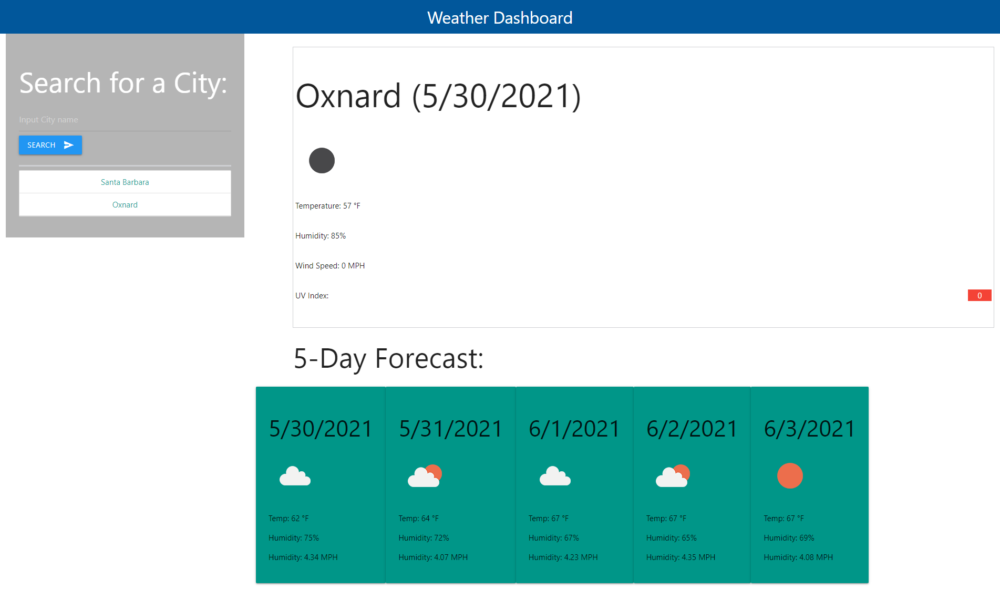

# Weather-Dashboard

 

[Click Here for Live Site](https://teku-guy.github.io/Weather-Dashboard/)

## Table of Contents
  - [Description](#description)
  - [Usage](#usage)
  - [License](#license)
  - [Contributing](#contributing)
  - [Tests](#tests)
  - [Questions](#questions)

## Description

## Usage

## License

 
This application is covered by the MIT license. 
    

## Contributing
Gustavo Muratalla

## Tests
Check out our live site [here](https://teku-guy.github.io/Weather-Dashboard/)

## Questions
U can always open a github issues prompt from our github repo 
 
:octocat: Find me on GitHub: [Teku-Guy](https://github.com/Teku-Guy) 
  
 Email me with any questions: gusmuratalla@gmail.com  
